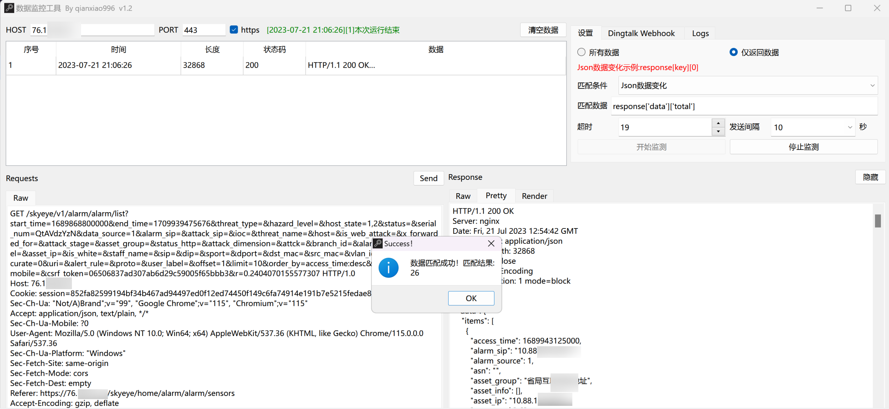

# 数据监控工具

 

## 工具简介



        数据监控工具可用来监控数据包变化，支持数据包长度变化、状态码变化、数据包包含关键字、数据正则匹配、返回长度大小、json数据变化监控，可用于护网漏洞告警监控（仅适用于告警较少的情况）。

### 监控类型

1、数据包长度变化

选择此项，下一个数据包长度发生变化即进行提示。

2、状态码变化

选择此项，下一个数据包状态码发生变化即进行提示。

3、数据包包含关键字

选择此项，**匹配数据**应填写关键字，匹配到关键字即进行提示。

4、数据正则匹配

选择此项，**匹配数据**应填写正则表达式，正则表达式匹配成功即进行提示。

5、返回长度大于

选择此项，**匹配数据**应填写数字，当返回长度大于此数字即进行提示。

6、返回长度小于

选择此项，**匹配数据**应填写数字，当返回长度小于此数字即进行提示。

7、json数据变化监控

选择此项，应选中一条数据，**匹配数据**应填写json表达式项的字符串项，当json表达式项的值发生变化进行提示。

**json表达式项**

如返回包如下

```http
HTTP/1.1 200 OK
Server: nginx
Date: Fri, 21 Jul 2023 12:54:42 GMT
Content-Type: application/json
Content-Length: 32868
Connection: close
Vary: Accept-Encoding
X-XSS-Protection: 1 mode=block

{
	"data": {
		"items": [{
			"access_time": 1689943125000,
			"alarm_sip": "10.x.x.x",
			"alarm_source": 1,
			"asn": "",
			"asset_group": "地址",
			"asset_info": [],
			"type": "信息泄露",

		}],
		"status": 1000,
		"token": "0382b6f38d472d0ea70a05b88e7f5c39",
		"total": 26
	}
}

```

 如匹配total字段，使用`response['data']['total']`

# 警告！

**请勿用于非法用途！否则自行承担一切后果**
